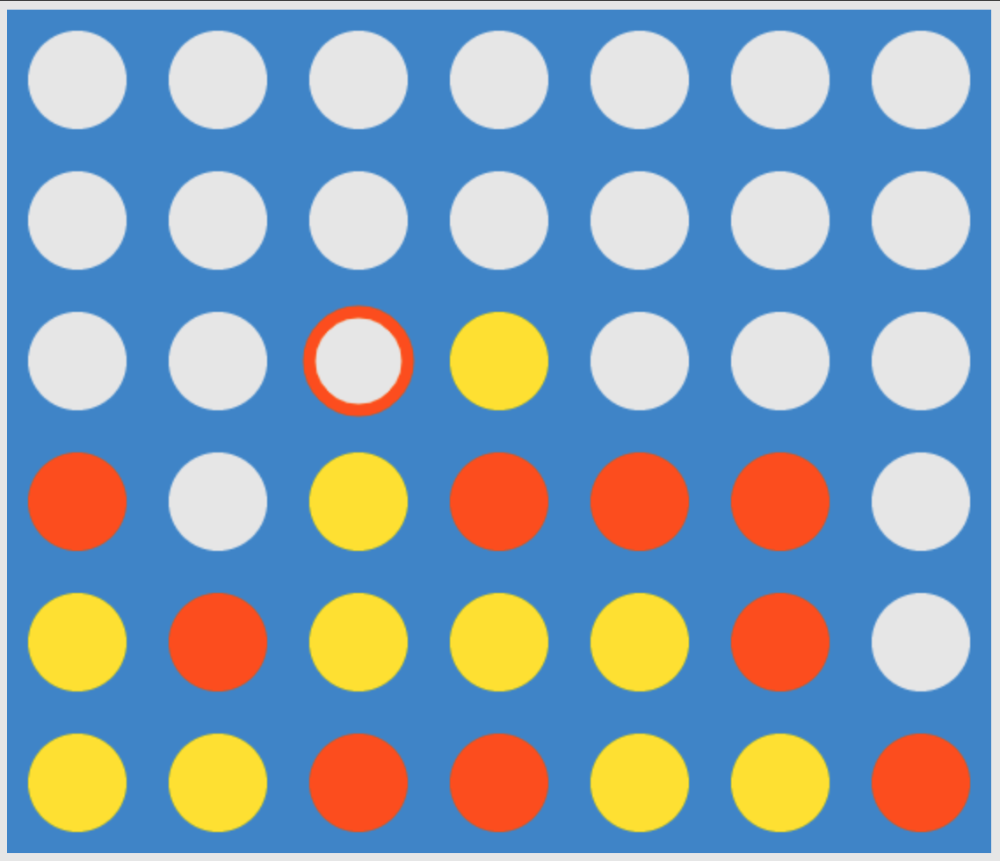

# Connect Four 



This is a simple clone of the classic Connect Four game made with plain JavaScript.

## Getting Started

These instructions will get you a copy of the project up and running on your local machine for development and testing purposes. See deployment for notes on how to deploy the project on a live system.

### Setup
In your html file, create a new canvas and give it an id.
```html
<canvas id="my-canvas" width='480' height='480'>
```
Then in a script tag within your HTML or in an external javascript file, create a reference to your canvas element and pass that along to the TicTacToeGame constructor.

```html
<script src='connect4.js'></script>
<script>
  var canvas = document.getElementById('my-canvas');
  var tictac = new Connect4Game(canvas, options)
</script>
```

### Options

| Parameter  | Type    | Default |
|------------|---------|---------|
| aiIsOn     | Boolean | true    |
| difficulty | 1, 2, 3 | 2       |

## License

This project is licensed under the MIT License - see the [LICENSE.md](LICENSE.md) file for details
